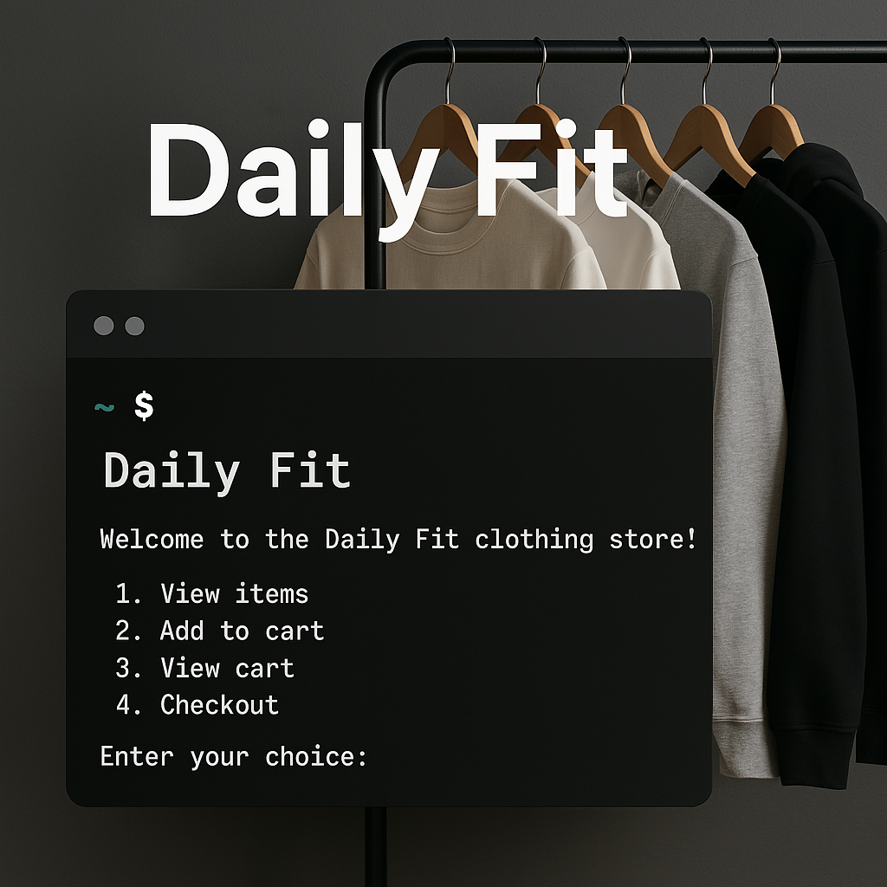

# 🛍️ 콘솔 쇼핑몰 관리 시스템
   

Oracle DB와 Java를 기반으로 한 콘솔 기반 쇼핑몰 사용자/관리자 시스템입니다.

## 📌 프로젝트 개요

- 콘솔 환경에서 **사용자**와 **관리자**가 사용 가능한 쇼핑몰 시스템입니다.
- 회원가입, 로그인, 상품 조회, 장바구니, 구매, 리뷰 작성, 회원 탈퇴 등 다양한 기능 제공
- **3-Tier 구조(UI → Service → DAO)**를 따르는 객체지향 설계
- JDBC와 Oracle을 사용한 데이터 연동 구현

## 📁 프로젝트 계층 구조

```
src/
├── kr.ac.kopo.ui               # 사용자/관리자 콘솔 UI
├── kr.ac.kopo.service          # 비즈니스 로직
├── kr.ac.kopo.dao              # DB 연동 계층 (JDBC)
├── kr.ac.kopo.vo               # VO (데이터 객체)
├── kr.ac.kopo.util             # 공통 유틸리티 (LoginSession 등)
└── ShopMain.java               # 실행 메인 클래스
```

## 📦 주요 기능

### 🙍 사용자 (USER)

- ✅ 회원가입 및 로그인
- ✅ 마이페이지
  - 구매 내역 조회
  - 상품별 리뷰 작성 (✅ 본인이 구매한 상품만 가능, 중복 리뷰 불가)
  - 비밀번호 변경 / 회원탈퇴
- ✅ 상품 검색 (이름, 카테고리, 가격대 등)
  - 리뷰 수 포함 정렬된 목록 출력
- ✅ 장바구니 담기 / 삭제
- ✅ 바로 구매
- ✅ 비밀번호 찾기, 아이디 찾기

### 👨‍💼 관리자 (ADMIN)

- ✅ 전체 사용자 목록 조회
- ✅ 사용자 개별 삭제 (자식 테이블 데이터와 연동 처리 필요)
- ✅ 전체 상품 관리: 조회 / 추가 / 수정 / 삭제
- ✅ 시퀀스 관리 (products_seq 등)

## 🧾 테이블 구조 (Oracle 기준)

### users

| 컬럼명     | 타입         | 설명         |
|------------|--------------|----------------|
| id         | VARCHAR2     | 사용자 ID (PK) |
| password   | VARCHAR2     | 비밀번호       |
| name       | VARCHAR2     | 이름            |
| email      | VARCHAR2     | 이메일         |
| phone      | VARCHAR2     | 전화번호       |
| role       | VARCHAR2     | 'ADMIN' 또는 'USER' |

### products

| 컬럼명        | 타입      | 설명            |
|---------------|-----------|------------------|
| product_id    | NUMBER    | 상품 ID (PK, 시퀀스 사용) |
| name          | VARCHAR2  | 상품명            |
| category      | VARCHAR2  | 카테고리 (상의/하의/신발 등) |
| price         | NUMBER    | 가격 (원)         |
| stock         | NUMBER    | 재고 수량         |
| product_size  | VARCHAR2  | 사이즈 (ex. M, L)  |
| color         | VARCHAR2  | 색상              |

### orders / order_details / reviews / cart

💬 이들 컬럼은 구매 및 리뷰, 장바구니 관리를 위해 사용되며  
user_id, product_id에 대한 FK 관계를 갖습니다.

## 🛠️ 개발 환경

| 항목           | 버전              |
|----------------|-------------------|
| Java           | 8 이상            |
| Oracle DB      | Oracle 12c 이상   |
| JDBC           | Oracle JDBC Driver |
| IDE            | IntelliJ / Eclipse (선택) |
| Build Tool     | 없음 (순수 Java 프로젝트) |

## ▶️ 실행 방법

1. Oracle DB에 테이블 및 시퀀스 생성
2. Java 프로젝트 클론 또는 열기
3. DB 접속 정보 설정 (ConnectionFactory 등)
4. ShopMain.java 실행
5. 로그인 후 사용자 또는 관리자 기능 이용

## ✅ 트랜잭션 및 예외 처리

- ❗ 회원 탈퇴 시 관련된 리뷰, 주문, 장바구니 데이터가 존재하면 삭제 불가  
→ → 트랜잭션 처리 및 자식 데이터 삭제 처리 필요
- ❗ 사용자 탈퇴 시 `ORA-02292` 방지:  
   - `ON DELETE CASCADE` 또는  
   - 애플리케이션에서 자식 데이터 선삭제 처리 구현

## 🔐 보안 관련 처리

- 비밀번호는 현재 평문 처리 → 실제 배포 시 암호화 방식 적용 필요
- 비밀번호 찾기 시 마스킹 처리 적용 (예: a***4)

## 📈 향후 개선 사항

- Java GUI 기반 화면 추가 (Swing/JavaFX)
- Spring 기반 웹 프로젝트로 확장
- 관리자 상품 분석/차트 기능
- 이메일 인증 / 임시 비밀번호 발급 / 암호화 보안
